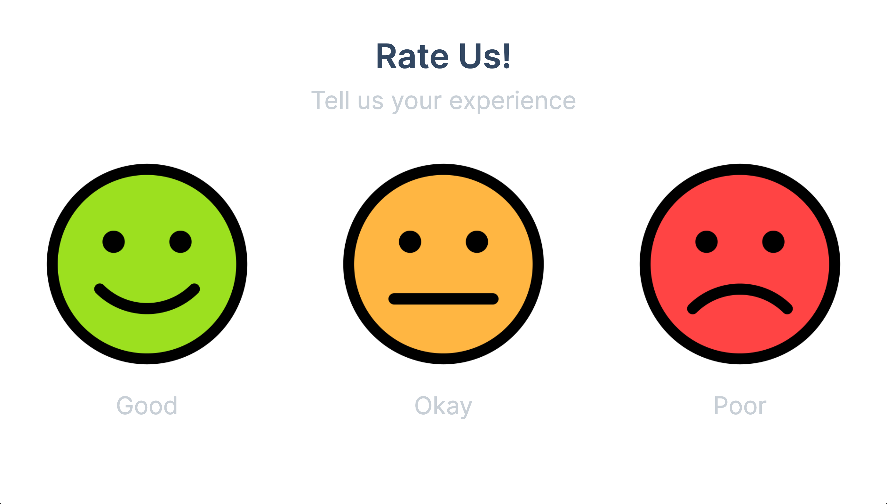

# CTE Event Feedback System

This is a simple feedback system for the upcoming SBISD CTE event. It is designed to work with the feedback boxes built by students at Westchester Academy for International Studies, which is why the inputs are assigned to arrow keys. To see the system in action, head over to [https://cte.0z.gg/](https://cte.0z.gg/).

## Features
- Plug-and-play with **any** feedback box
- Adaptive thank you messages, based on feedback
- Simple, easy to use interface
- No database required, all information is stored **locally** on your device
- Reset button to clear feedback
    - Stores previous feedback in local storage, corresponding to the date and time it was reset, in case you need to recover it
- Easily view **totals** and **percentages** of each feedback type
- Locks inputs for a few seconds after each feedback submission to prevent spamming
    - Also locks inputs for a few seconds when viewing totals or resetting
- Escape key to exit total or reset screens

## How To Use
1. Visit [https://cte.0z.gg/](https://cte.0z.gg/) on a device with USB-A support (due to feedback box compatibility)
2. Plug in your feedback box
3. Click on a feedback type and watch the magic happen!

## Key Assignments
1. Left Arrow: **Good** 🙂
2. Up Arrow: **Fine** 😐
3. Right Arrow: **Poor** 🙁
4. Down Arrow: **Show Totals** 📊
5. Spacebar: **Reset** 🔄
6. Escape: **Exit** 🚪

## How To Run Locally
1. Clone this repository
2. `cd` into the cloned repository
3. Install Node.js & NPM if you haven't already
    - `brew install node` if you're on MacOS
    - Download the [Windows Installer](https://nodejs.org/en/#home-downloadhead) directly from the [nodejs.org](https://nodejs.org) website if you're on Windows
    - `cinst nodejs.install` using Chocolatey
4. Run `npm install` to install all dependencies
5. Run `npm start` to start the server

